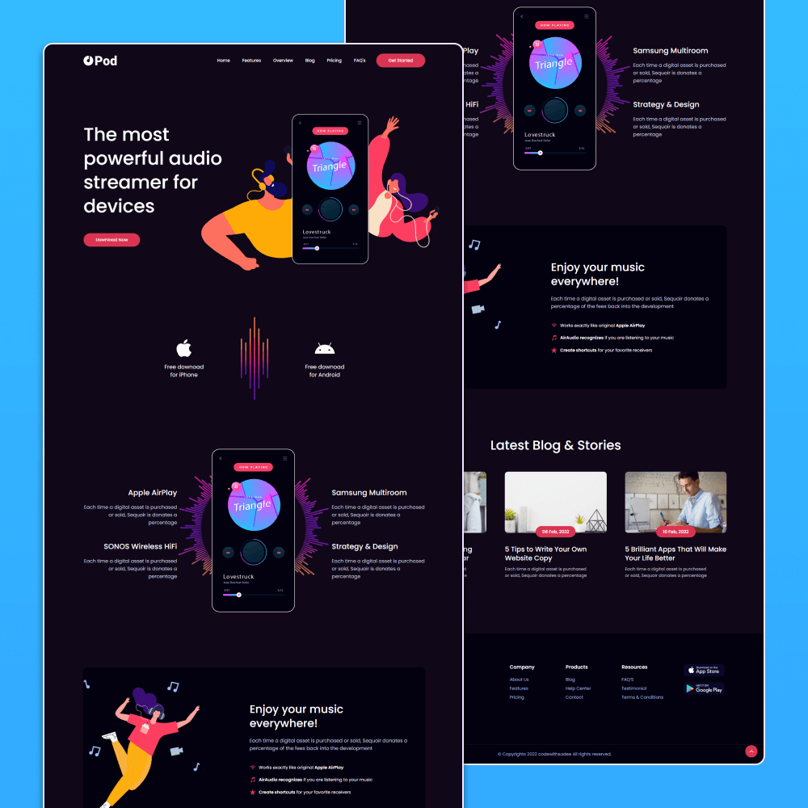

# Pod - Audio streaming app landing page

Pod is a fully responsive audio streaming app landing page, responsive for all devices, built using HTML, CSS, and JavaScript.

## Demo



## Prerequisites

Before you begin, ensure you have met the following requirements:

* [Git](https://git-scm.com/downloads "Download Git") must be installed on your operating system.

## Installing Pod

To install **Pod**, follow these steps:

Linux and macOS:

```bash
sudo git clone https://github.com/Web-CODED/Audio-Streaming_Webpage.git
```

Windows:

```bash
git clone https://github.com/Web-CODED/Audio-Streaming_Webpage.git
```

## License

This project is **free to use** and does not contains any license.
